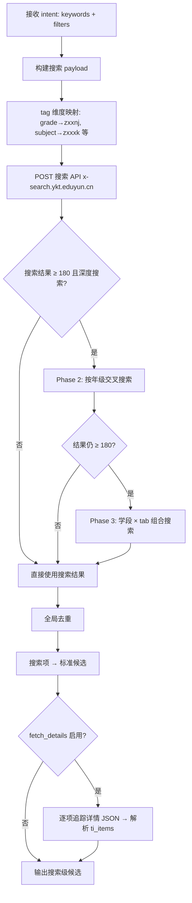
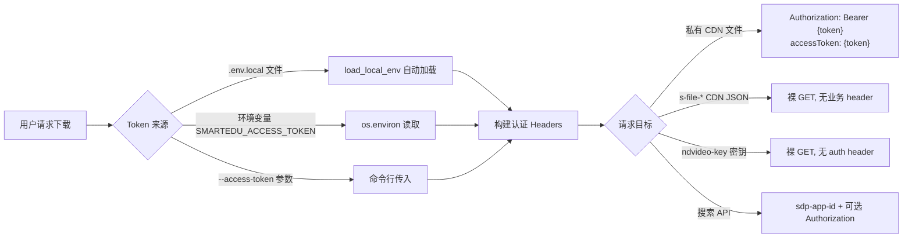

# SmartEdu 平台架构说明

> 本文档描述 `platforms/smartedu` 的整体架构、资源下载流程和错误处理策略。
> 接口契约详见 `../../../shared/schemas/platform-search-contract.md` 和 `../../../shared/schemas/platform-download-contract.md`。

---

## 一、模块总览

SmartEdu 平台 Skill 采用 **脚本适配器** 模式，整体由三层组成：

```
┌──────────────────────────────────────────────────────┐
│              resource-search / resource-downloader    │
│                   (调度层 — 流程编排)                   │
└──────────────────────┬───────────────────────────────┘
                       │ PlatformSkill 接口
┌──────────────────────▼───────────────────────────────┐
│           adapter.py (SmartEduSkill)                   │
│  继承 CLIBasedPlatformSkill，构建子进程命令并解析输出     │
└──────────────────────┬───────────────────────────────┘
                       │ subprocess (Python CLI)
┌──────────────────────▼───────────────────────────────┐
│                   scripts/ (CLI 脚本层)                │
│                                                        │
│  smartedu_resources.py    搜索 + 候选标准化 (11 子命令) │
│  smartedu_download.py     全资源下载器 (3 子命令)       │
│  smartedu_tch_material.py 教材批量下载 (6 子命令)       │
│  fetch_textbooks.py       教材下载 Agent 包装器         │
│  smartedu_browser_session.py  浏览器会话管理            │
│  _auth_http.py            HTTP 传输 + 授权层            │
│  _constants.py            共享常量                      │
│  _text_utils.py           纯文本/URL 工具               │
│  _catalog.py              栏目/路由处理                  │
│  _search.py               搜索 + 候选标准化              │
│  _detail.py               详情探测 + 候选标准化          │
│  _page_profile.py         页面 HTML/JS 分析             │
└──────────────────────────────────────────────────────┘
```

### 脚本职责矩阵

| 脚本 | 职责 | 模块化状态 |
|------|------|-----------|
| `adapter.py` | 实现 `PlatformSkill` 接口，桥接调度层与 CLI 脚本 | 独立 |
| `smartedu_resources.py` | 搜索 API 调用 + 搜索响应解析 + 详情追踪 + 候选标准化 | Phase 3E 拆分为 7 个子模块 |
| `smartedu_download.py` | 全类型资源下载（PDF/m3u8/音频/图片/字幕/白板） | 独立 |
| `smartedu_tch_material.py` | 教材索引同步 + 批量 PDF 下载 + 预览图下载 | 独立 |
| `fetch_textbooks.py` | 教材下载 Agent 包装器，整理到资料库目录结构 | 独立 |
| `smartedu_browser_session.py` | Playwright 浏览器会话管理（登录/探测/请求） | 独立 |

### 子模块依赖关系

```
smartedu_resources.py (主文件，命令处理)
    ├── _constants.py     (纯数据，无依赖)
    ├── _text_utils.py    (纯工具，仅依赖标准库)
    ├── _auth_http.py     (传输层，依赖 _text_utils)
    ├── _page_profile.py  (页面分析，依赖 _auth_http, _text_utils)
    ├── _catalog.py       (栏目处理，依赖 _constants, _text_utils)
    ├── _search.py        (搜索域，依赖 _catalog, _constants, _text_utils)
    └── _detail.py        (详情域，依赖 _auth_http, _catalog, _search, _constants, _text_utils)
```

依赖方向严格单向：`_detail → _search → _catalog → _constants / _text_utils`，无循环依赖。

---

## 二、资源类型覆盖说明

SmartEdu 平台覆盖 **四种核心资源类型**，每种类型的下载流程不同：

### 2.1 PDF 文档（教材、课件、教学设计）

**数据来源**: `ti_items[].ti_storages[]` 中的私有 CDN URL

**下载流程**:
```
详情页 URL → 解析 contentId → 裸 GET 详情 JSON (s-file-*.ykt.cbern.com.cn)
    → 提取 ti_items 中 format=pdf 的条目
    → 提取 ti_storages 中的私有 CDN URL (r*-ndr-private.ykt.cbern.com.cn)
    → 转换为公开 CDN URL (r*-ndr.ykt.cbern.com.cn)
    → 有 Token → 私有 CDN 优先下载 (Authorization: Bearer + accessToken)
    → 无 Token → 公开 CDN 下载
```

**关键实现**: `smartedu_download.py` 的 `try_download_with_fallback()` 函数

**降级策略**: 无 Token 时尝试公开 CDN；公开 CDN 也失败时尝试私有 CDN（不带 Token）

### 2.2 m3u8 视频（精品课、课堂实录、微课）

**数据来源**: `ti_items[].ti_storages[]` 中 format 为 `application/x-mpegurl` 的条目

**下载流程** (5 步):
```
① 获取 M3U8 播放列表 → 解析 TS 分段列表和 EXT-X-KEY 加密信息
② 密钥交换（如加密）:
   → GET {key_url}/signs → 获得 nonce
   → sign = MD5(nonce + key_id)[:16]
   → GET {key_url}?nonce=...&sign=... → 获得 base64 加密的 key
   → AES-ECB 解密（key=sign）→ 得到最终解密 key
③ 并发下载 TS 分片 → 从 r1/r2/r3 主机轮换下载（避免单节点限流）
④ AES-CBC 解密 → 每个分片用解密 key + IV 解密
⑤ 合并 → 按顺序合并所有解密后的 TS → 输出 .ts 文件
```

**关键实现**: `smartedu_download.py` 的 `download_m3u8_video()` 函数

**重要细节**:
- 密钥交换接口 `ndvideo-key.ykt.eduyun.cn` **必须裸 GET**，不能加 auth header
- 高并发下载 TS 分片时单一 CDN 节点返回 `400 InvalidArgument`，需轮换 r1/r2/r3 主机
- 需要安装 `pycryptodome` 或 `cryptography` 库进行 AES 解密
- 默认并发数 5，可通过 `--video-concurrency` 调整

### 2.3 音频（MP3/OGG 课文朗读、诵读库）

**数据来源**: `ti_items[].ti_storages[]` 中 format 为 `mp3`/`ogg` 的条目

**下载流程**: 与 PDF 相同，走 `try_download_with_fallback()` 通用文件下载路径

**注意**: 部分教材有独立的音频关联列表 `relation_audios.json`

### 2.4 图片（课件截图、封面）

**数据来源**: `ti_items[].ti_storages[]` 中 format 为 `jpg`/`png` 的条目

**下载流程**: 与 PDF 相同，走通用文件下载路径

### 2.5 其他格式

| 格式 | 说明 | 下载方式 |
|------|------|---------|
| `whiteboard` | 电子白板 | 直接下载 |
| `srt` | 字幕文件 | 直接下载 |

---

## 三、下载流程图

### 3.1 完整下载流程（Mermaid）


### 3.2 搜索流程（Mermaid）



### 3.3 认证流程



---

## 四、错误处理策略

### 4.1 错误场景与处理方式

所有错误码遵循 `../../../shared/schemas/error-codes.md` 中的统一错误码体系。

#### 网络超时

| 触发条件 | 处理策略 | 错误码 |
|---------|---------|--------|
| 搜索/下载请求超时 | `platform_base.py` 的 `subprocess.run(timeout=...)` 捕获 | `NETWORK_TIMEOUT` |
| TS 分片下载超时 | 单分片 3 次即时重试 + 3 轮全局重试 | `DOWNLOAD_FAILED` |
| 详情 JSON 获取超时 | 多 server 轮询（s-file-1/2/3）+ backup 模板 | `NETWORK_TIMEOUT` |

**重试机制**:
- HTTP 请求: `request_json()` 内置 2 次重试，递增延时（0.4s × attempt）
- TS 分片: 4 次主机轮换尝试（r1→r2→r3→r1），指数退避（0.3s × attempt）
- 失败分片: 最多 3 轮全局重试，每轮间隔 1 秒

#### 认证失败

| 触发条件 | 处理策略 | 错误码 |
|---------|---------|--------|
| 下载返回 403/401 | 标记 `needs_manual_assist`，引导用户重新获取 Token | `AUTH_SESSION_EXPIRED` |
| 资源需要登录 | 标记 `requires_auth=true`，候选不丢弃 | `AUTH_LOGIN_REQUIRED` |
| Token 格式错误 | `fulfill_token()` 自动包装为 MAC 格式 | — |

**降级路径**:
1. 有 Token → 私有 CDN 下载（原始质量）
2. Token 失效 → 尝试公开 CDN（部分资源可获取）
3. 公开 CDN 也失败 → 标记 `requires_auth`，交由用户决定
4. 无 Token 但需要下载 → 可降级为预览图（`download-previews` 命令）

#### 资源不存在

| 触发条件 | 处理策略 | 错误码 |
|---------|---------|--------|
| 详情 JSON 返回 404 | 标记 `not_found`，从候选中移除 | `CONTENT_NOT_FOUND` |
| 详情 JSON 无 ti_items | 标记 `ok_no_file_items`，返回降级候选 | `CONTENT_NOT_AVAILABLE` |
| 资源已被删除/下架 | 标记 `requires_auth`（CDN 返回 403 难以区分） | `CONTENT_NOT_FOUND` |
| ti_items 中无匹配格式 | 列出所有可用格式供用户选择 | `PARSE_FORMAT_NOT_SUPPORTED` |

#### 反爬/CDS WAF

| 触发条件 | 处理策略 | 错误码 |
|---------|---------|--------|
| s-file-* CDN 返回 403 | 切换为裸 GET（不加 Content-Type/Origin/Referer） | `ANTI_CRAWL_BLOCKED` |
| ndvideo-key 接口返回 403 | 必须裸 GET，不能加 auth header | `ANTI_CRAWL_BLOCKED` |
| TS 分片返回 400 InvalidArgument | 轮换 r1/r2/r3 主机 | `ANTI_CRAWL_RATE_LIMITED` |
| 搜索 API 连续失败 | `platform_base.py` 断路器触发熔断 | `ANTI_CRAWL_BLOCKED` |

#### 解析错误

| 触发条件 | 处理策略 | 错误码 |
|---------|---------|--------|
| URL 无法识别 | `parse_detail_url()` 抛出 `ValueError`，列出支持的路径 | `PARSE_STRUCTURE_CHANGED` |
| 详情 JSON 解析失败 | 尝试多个详情 JSON URL 模板 + backup | `PARSE_FORMAT_NOT_SUPPORTED` |
| AES 解密库未安装 | 跳过 m3u8 格式，仅下载其他格式 | `SYSTEM_TOOL_NOT_FOUND` |

### 4.2 断路器保护（platform_base.py 集成）

SmartEdu 适配器继承 `CLIBasedPlatformSkill`，自动获得断路器保护：

```
CLOSED（正常）──连续失败 5 次──> OPEN（熔断，暂停 300 秒）
                                    │
                                    │ 冷却完成
                                    ▼
                               HALF_OPEN（放行一次试探）
                                    │
                              ┌─────┴─────┐
                          成功 │           │ 失败
                              ▼           ▼
                          CLOSED       OPEN（重置冷却）
```

- **保护范围**: 仅平台级故障（子进程失败/超时）
- **不保护**: 配置错误（脚本不存在）→ 直接返回 `SYSTEM_TOOL_NOT_FOUND`
- **熔断时行为**: 搜索/下载请求直接返回 `ANTI_CRAWL_BLOCKED`，不实际调用脚本

### 4.3 多级容错策略

```
Level 0 (完整)     原始文件完整下载 — PDF/m3u8/mp3 等
    ↓ 失败
Level 1 (预览)     教材预览图 — download-previews
    ↓ 失败
Level 2 (元数据)   候选信息（标题/描述/来源链接）— 不下载文件
    ↓ 失败
Level 3 (跳过)     标记 requires_auth，从结果中移除
```

---

## 五、与 platform_base.py 的集成方式

### 5.1 类继承关系

```
PlatformSkill (抽象基类)
    └── CLIBasedPlatformSkill (CLI 默认实现，含速率限制/断路器/凭证管理)
            └── SmartEduSkill (adapter.py)
```

### 5.2 适配器覆盖的方法

SmartEdu 的脚本命名与统一约定有历史差异，因此适配器覆盖了以下方法：

| 方法 | 基类默认行为 | SmartEdu 覆盖 | 原因 |
|------|-------------|--------------|------|
| `_build_search_cmd()` | `{script} search {keyword} --max {n} -o {file}` | `{script} search-resources --query {keyword} --max {n} -o {file}` | 子命令是 `search-resources` 而非 `search` |
| `_search_script` | `*_search.py` 自动发现 | 显式指定 `smartedu_resources.py` | 文件名不符合约定 |
| `_download_script` | `*_dl.py` 自动发现 | 显式指定 `smartedu_download.py` | 文件名不符合约定 |

### 5.3 数据流

```
调度层 (resource-search)
    │
    │  intent = {keywords: "三年级数学", max_results: 20, ...}
    │
    ▼
SmartEduSkill.search(intent)
    │
    │  1. 断路器检查 (before_call)
    │  2. 速率限制 (acquire)
    │  3. 解析运行时凭证 → 注入子进程 env (SMARTEDU_ACCESS_TOKEN 等)
    │  4. 构建 output_file 路径 (tempdir/smartedu_search.json)
    │  5. _build_search_cmd(intent, output_file) → 命令列表
    │  6. subprocess.run(cmd, env=sub_env, timeout=120)
    │
    ▼
smartedu_resources.py search-resources --query "三年级数学" --max 20 -o /tmp/smartedu_search.json
    │
    │  1. load_local_env() → 加载 .env.local
    │  2. 构建 tag 维度筛选 (grade→zxxnj, subject→zxxxk)
    │  3. POST x-search.ykt.eduyun.cn/v1/resources/combine/search
    │  4. 解析搜索响应 → 标准候选 (learning-resource-candidate/v1)
    │  5. (可选) 追踪详情 JSON → 解析 ti_items
    │  6. 输出到 -o 指定的文件
    │
    ▼
SmartEduSkill.search() 继续
    │
    │  7. 读取 output_file → JSON 解析
    │  8. _normalize_search_result() → 契约格式
    │  9. _record_success() / _record_failure() → 通知断路器
    │
    ▼
调度层收到标准结果
    {
      "platform": "smartedu",
      "query": "三年级数学",
      "results": [...]
    }
```

### 5.4 配置集成

SmartEdu 适配器的参数优先级（高 → 低）：

1. **显式构造参数**: `SmartEduSkill(min_request_interval=2.0)`
2. **环境变量**: `LRS_PLATFORMS__SMARTEDU__MIN_REQUEST_INTERVAL=2.0`
3. **配置文件**: `config/settings.yaml` 中 `platforms.smartedu` 段
4. **代码默认值**: `min_request_interval=1.0` 等

示例配置 (`config/settings.yaml`):
```yaml
platforms:
  smartedu:
    min_request_interval: 1.5
    failure_threshold: 5
    recovery_timeout: 300
    request_timeout: 120
    download_timeout: 600
```

### 5.5 凭证传递

凭证通过 `CredentialManager` 安全传递到子进程：

```
CredentialManager
    │
    ├── 显式传入 credentials={...}        ← 最高优先级
    ├── intent/candidate 中携带的凭证字段    ← 运行时动态
    ├── 环境变量 SMARTEDU_ACCESS_TOKEN      ← .env.local 或 export
    └── 配置文件 credentials.json           ← 最低优先级
            │
            ▼
    _build_subprocess_env() → {SMARTEDU_ACCESS_TOKEN: "...", ...}
            │
            ▼
    subprocess.run(cmd, env={**os.environ, SMARTEDU_ACCESS_TOKEN: "..."})
```

日志输出自动脱敏：Token/Cookie 显示为 `****xxxx` 格式。

---

## 六、CDN 与认证机制

SmartEdu 使用多套 CDN 和不同的认证策略，这是平台最复杂的技术点：

| CDN / 接口 | 主机名 | 认证方式 | 用途 | 注意事项 |
|-----------|--------|---------|------|---------|
| 公开 CDN | `r*-ndr.ykt.cbern.com.cn` | 无需认证 | 部分公开资源 | 降级下载路径 |
| 私有 CDN | `r*-ndr-private.ykt.cbern.com.cn` | `Authorization: Bearer <token>` + `accessToken: <token>` | 源文件（PDF/视频/课件） | 双重 header 必须同时携带 |
| 详情 JSON | `s-file-*.ykt.cbern.com.cn` | **裸 GET** | 资源元数据 JSON | 加业务 header 反而 403 |
| 视频密钥 | `ndvideo-key.ykt.eduyun.cn` | **裸 GET** | m3u8 解密密钥交换 | 不能加 auth header |
| 搜索 API | `x-search.ykt.eduyun.cn` | `sdp-app-id` + 可选 Authorization | 站内搜索 | 搜索本身不需要授权 |

### 关键技术陷阱

1. **详情 JSON 裸 GET**: `s-file-*` CDN 的 JSON 加 `Content-Type`/`Origin`/`Referer` 等 header 会触发 CDN WAF 403。`_auth_http.py` 的 `is_cdn_json_url()` 自动检测并切换为裸 GET。

2. **视频密钥裸 GET**: `ndvideo-key` 接口加 `Authorization` header 会返回 403。`smartedu_download.py` 的 `_get_json_key()` 检测到 `ndvideo-key` 主机名时自动移除 auth header。

3. **TS 下载轮换主机**: 高并发下载 TS 分片时，单一 `r*-ndr` 节点返回 `400 InvalidArgument`。`download_ts_segment()` 内置 r1/r2/r3 主机轮换 + 指数退避重试。

4. **私有 CDN URL 转换**: 私有 CDN URL（`r*-ndr-private`）可通过替换主机名转为公开 CDN URL（`r*-ndr`），但 `.pkg/filename.pdf` 需简化为 `.pdf`。`convert_cdn_url()` 负责此转换。

---

## 七、搜索深度增强

SmartEdu 搜索 API 有硬性限制：单次请求最多返回 200 条（offset + limit ≤ 200）。深度搜索功能突破此限制：

### 深度搜索三阶段

| 阶段 | 策略 | 触发条件 |
|------|------|---------|
| Phase 1 | 原始关键词 + 全 tab 自动分页 | 默认 |
| Phase 2 | 按年级细分交叉搜索 | Phase 1 结果 ≥ 180 条 |
| Phase 3 | 按学段 × tab 组合搜索 | Phase 2 结果仍 ≥ 180 条 |

全局去重使用 `resource_id:title` 指纹，确保跨阶段不重复。

---

## 八、环境依赖

### 必需

- Python 3.9+
- 标准库: `urllib`, `json`, `hashlib`, `concurrent.futures` 等

### 可选（按功能需要）

| 依赖 | 用途 | 安装方式 |
|------|------|---------|
| `pycryptodome` | m3u8 视频 AES 解密（推荐） | `pip install pycryptodome` |
| `cryptography` | m3u8 视频 AES 解密（备选） | `pip install cryptography` |
| `playwright` | 浏览器会话（受限内容获取） | `pip install playwright && python -m playwright install chromium` |

### 环境变量

| 变量名 | 用途 | 必需性 |
|--------|------|--------|
| `SMARTEDU_ACCESS_TOKEN` | 源文件下载授权 | 下载源文件（PDF/视频等）时必需 |
| `SMARTEDU_COOKIE` | 页面会话凭据 | 部分受限内容需要 |
| `SMARTEDU_AUTHORIZATION` | 搜索 API 授权头 | 高级用途 |
| `SMARTEDU_HEADERS` | 额外请求头 | 高级用途 |
| `SMARTEDU_SDP_APP_ID` | 搜索 API 应用 ID | 有默认值，通常不需要 |

---
